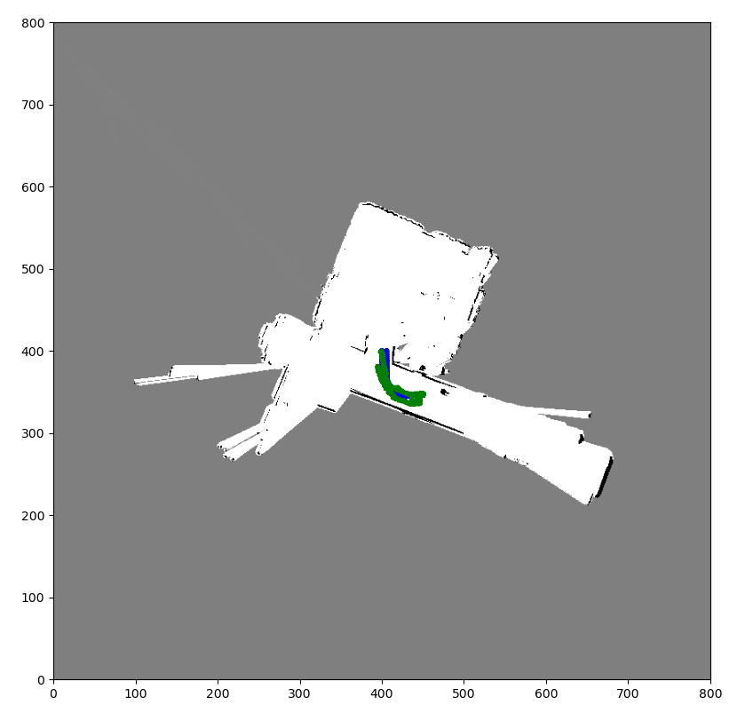
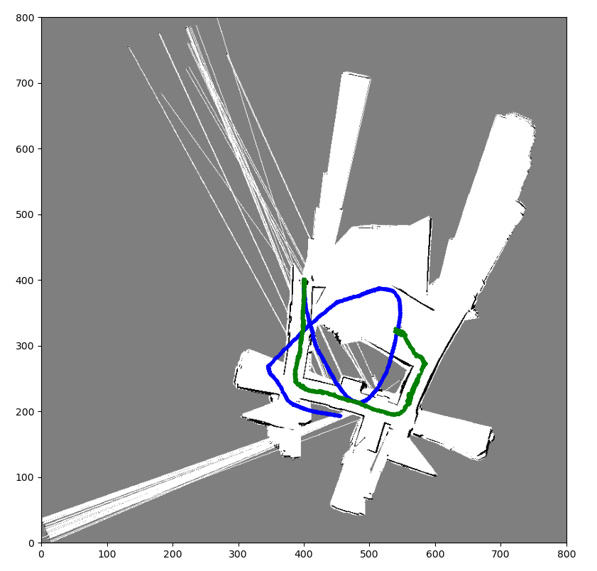
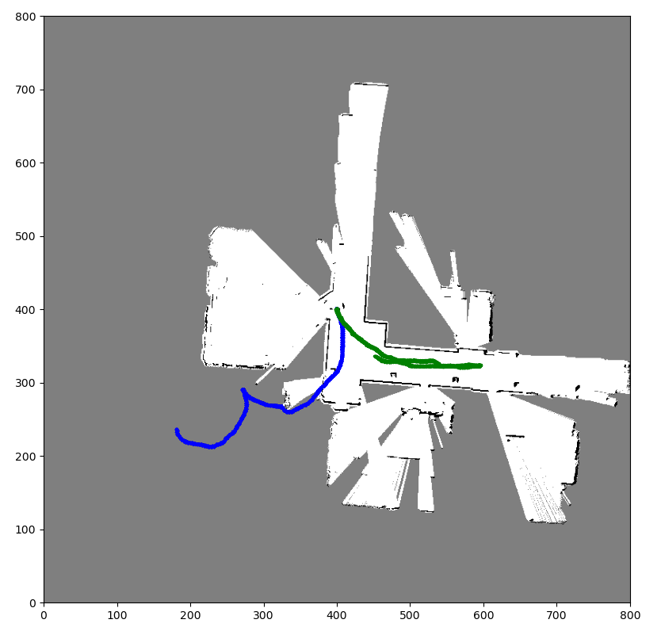
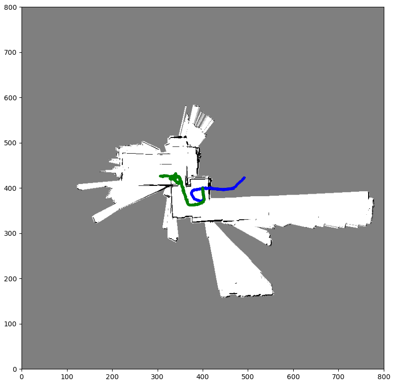

# SLAM-on-Humanoid-Robot

The dataset comprises lidar scans collected from a THOR-OP humanoid robot. To convert the lidar data into map coordinates, I applied appropriate transformations and filtered out ground plane points. A sufficient number of particles were initialised to represent the robot's pose. Then a particle filter approach was implemented to select the best particle with the highest correlation, and subsequently updated the log odds of the map.

# Results

<table>
  <tr>
      <td align = "center">  </td>
      <td align = "center">  </td>
  </tr>
  <tr>
      <td align = "center"> World 1 </td>
      <td align = "center"> World 2 </td>
  </tr>
</table>

<table>
  <tr>
      <td align = "center">  </td>
      <td align = "center">  </td>
  </tr>
  <tr>
      <td align = "center"> World 3 </td>
      <td align = "center"> World 4 </td>
  </tr>
</table>
